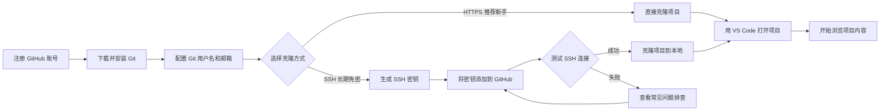

# Beastkin Universe 新手入门完整指南
# Beastkin Universe Complete Beginner Setup Guide

---

## 前言 / Introduction

本指南面向**完全没有 Git 和 GitHub 使用经验**的新手，手把手教你完成从注册账号到把项目下载到本地电脑的全过程。

This guide is for **complete beginners** with no prior Git or GitHub experience. We will walk you through
everything from account registration to downloading the project to your local computer.

**本项目仓库地址**：https://github.com/memeticsingularity/beastkin-universe

如果你只是想先浏览项目内容，可以直接点击上方链接在浏览器中查看，无需下载任何工具。

---

## 前置信息 / Quick Info

| 项目 | 地址 |
|------|------|
| 仓库主页 | https://github.com/memeticsingularity/beastkin-universe |
| SSH 克隆地址 | `git@github.com:memeticsingularity/beastkin-universe.git` |
| HTTPS 克隆地址 | `https://github.com/memeticsingularity/beastkin-universe.git` |

---

## 流程总览 / Overview

下面是整个入门流程的鸟瞰图，让你对要做什么有一个整体印象。

Below is a bird's-eye view of the entire onboarding process.



> 提示：初次接触可能会觉得步骤很多，但每一步都很简单，跟着指南一步步来即可。

---

## 第1步：注册 GitHub 账号 / Step 1: Register a GitHub Account

GitHub 是全球最大的代码托管平台，本项目就存放在上面。

1. 打开浏览器，访问 [https://github.com](https://github)
2. 点击页面右上角的 **Sign up**（注册）按钮
3. 输入你的邮箱地址，设置密码和用户名
4. 完成邮箱验证（登录你的邮箱，点击 GitHub 发送的验证链接）
5. 注册完成后，登录你的 GitHub 账号

> 提示：用户名一旦设定很难修改，建议选择一个简洁、专业的名称。

---

## 第2步：下载并安装 Git / Step 2: Download and Install Git

Git 是一个版本控制工具，用来从 GitHub 下载代码和管理代码变更。

### Windows 用户

1. 访问 Git 官方下载页面：[https://git-scm.com/download/win](https://git-scm.com/download/win)
2. 下载会自动开始（如果未开始，点击页面上的下载链接）
3. 双击下载的 `.exe` 安装文件
4. 安装过程中保持默认选项即可，一路点击 **Next** 直到安装完成
5. 安装完成后，右键点击桌面或文件夹空白处，应该能看到 **Git Bash Here** 选项

### macOS 用户

打开终端（Terminal），输入以下命令：

```bash
xcode-select --install
```

然后安装 Homebrew（如果还没有安装）：

```bash
/bin/bash -c "$(curl -fsSL https://raw.githubusercontent.com/Homebrew/install/HEAD/install.sh)"
```

最后通过 Homebrew 安装 Git：

```bash
brew install git
```

### 验证安装是否成功

打开终端（Windows 用户打开 **Git Bash**），输入：

```bash
git --version
```

如果显示类似 `git version 2.40.0` 的信息，说明安装成功。

---

## 第3步：配置 Git / Step 3: Configure Git

安装完成后，需要告诉 Git 你是谁。打开终端（Windows 打开 Git Bash），依次输入以下两条命令，把引号里的内容换成你的真实信息：

```bash
git config --global user.name "你的名字"
git config --global user.email "你的GitHub注册邮箱"
```

例如：

```bash
git config --global user.name "Zhang San"
git config --global user.email "zhangsan@example.com"
```

验证配置是否成功：

```bash
git config --global user.name
git config --global user.email
```

如果正确显示了你的名字和邮箱，说明配置成功。

---

## 第4步：生成 SSH 密钥并添加到 GitHub / Step 4: Generate SSH Key and Add to GitHub

SSH 密钥相当于一把"安全钥匙"，让你的电脑和 GitHub 之间建立安全的连接，不需要每次输入密码。

### 4.1 生成密钥

在终端（Git Bash）中输入：

```bash
ssh-keygen -t ed25519 -C "你的GitHub注册邮箱"
```

按回车后，会提示你输入保存位置，**直接再按一次回车**使用默认位置即可。

接着会提示输入密码（passphrase），**建议直接按回车留空**，这样后续操作更方便。

看到类似 `+--[ED25519 256]--+` 的艺术图案，说明密钥生成成功。

### 4.2 复制密钥内容

Windows 用户输入：

```bash
cat ~/.ssh/id_ed25519.pub | clip
```

macOS 用户输入：

```bash
cat ~/.ssh/id_ed25519.pub | pbcopy
```

这条命令会把密钥内容复制到剪贴板。

> 如果上面的命令报错，可以手动打开文件复制：
> - Windows：用记事本打开 `C:\Users\你的用户名\.ssh\id_ed25519.pub`
> - macOS：用文本编辑器打开 `~/.ssh/id_ed25519.pub`

### 4.3 将密钥添加到 GitHub

1. 登录 GitHub，点击右上角头像，选择 **Settings**（设置）
2. 左侧菜单找到并点击 **SSH and GPG keys**
3. 点击右上角的 **New SSH key** 绿色按钮
4. Title（标题）随便填，比如"我的电脑"
5. Key（密钥）框里粘贴刚才复制的内容
6. 点击 **Add SSH key** 保存

### 4.4 测试连接

在终端输入：

```bash
ssh -T git@github.com
```

第一次连接会提示确认，输入 `yes` 并按回车。

如果看到类似 `Hi username! You've successfully authenticated...` 的提示，说明 SSH 配置成功。

---

## 第5步：克隆项目到本地 / Step 5: Clone the Project

"克隆"的意思就是把 GitHub 上的项目完整下载到你的电脑上。

### 5.1 确定存放位置

先想好要把项目放在哪里。比如你想放在 `D:\Projects` 文件夹下。

打开文件资源管理器，进入你想存放项目的文件夹（如果没有就新建一个）。

在文件夹空白处右键，选择 **Git Bash Here**，打开终端。

### 5.2 执行克隆命令

我们提供两种克隆方式，你可以任选其一：

#### 方式一：HTTPS（最简单，推荐新手）

不需要配置 SSH 密钥，直接复制粘贴以下命令：

```bash
git clone https://github.com/memeticsingularity/beastkin-universe.git
```

> **注意**：如果你开启了 GitHub 的双重验证（2FA），HTTPS 方式可能需要输入 Personal Access Token 代替密码。如果遇到提示输入密码的情况，建议切换到下面的 SSH 方式。

#### 方式二：SSH（配置一次，长期免密）

如果你已经完成了第4步的 SSH 密钥配置，使用以下命令：

```bash
git clone git@github.com:memeticsingularity/beastkin-universe.git
```

> **两种方式的区别**：
> - **HTTPS**：开箱即用，但以后每次向 GitHub 推送改动可能需要验证身份
> - **SSH**：初次配置稍麻烦，但以后所有操作都免密，更方便长期参与

按回车，等待下载完成。项目比较大，可能需要几分钟到十几分钟，取决于你的网络速度。

看到类似 `done.` 的提示，说明下载完成。

### 5.3 进入项目文件夹

```bash
cd beastkin-universe
```

现在你就已经在项目文件夹里了。

---

## 第6步：用 VS Code 打开项目（推荐）/ Step 6: Open the Project in VS Code (Recommended)

VS Code 是一款免费、好用的代码编辑器，非常适合查看和编辑本项目中的文本文件。

### 6.1 下载 VS Code

1. 访问 [https://code.visualstudio.com/](https://code.visualstudio.com/)
2. 点击下载按钮，根据你的系统选择 Windows 或 macOS 版本
3. 下载完成后安装

### 6.2 打开项目

**方法一**：直接在 Git Bash 中输入：

```bash
code .
```

**方法二**：打开 VS Code，点击左上角 **文件 > 打开文件夹...**，选择你刚才克隆的 `beastkin-universe` 文件夹。

---

## 常见问题排查 / Troubleshooting

### Q1: 克隆时提示 "Connection reset" 或 "Timeout"

这是网络连接问题，尝试以下方法：

1. **重试**：多试几次，可能是暂时的网络波动
2. **切换网络**：尝试使用手机热点或其他网络
3. **使用 HTTPS 代替 SSH**：
   ```bash
   git clone https://github.com/memeticsingularity/beastkin-universe.git
   ```

### Q2: 提示 "Permission denied (publickey)"

SSH 密钥没有配置好，请回到第4步重新检查：

1. 确认密钥已正确添加到 GitHub
2. 确认使用的是 `git@github.com` 开头的地址，不是 `https://`
3. 尝试手动启动 SSH 代理：
   ```bash
   eval "$(ssh-agent -s)"
   ssh-add ~/.ssh/id_ed25519
   ```

### Q3: Git Bash 中输入命令没有反应

检查是否安装了正确的 Git 版本。在 Windows 开始菜单搜索 "Git Bash"，确保打开的是 Git 自带的终端，而不是 Windows 的 CMD 或 PowerShell。

### Q4: 项目下载到一半中断了

进入项目文件夹，执行：

```bash
git pull
```

这会从中断的地方继续下载。

---

## 接下来可以做什么 / What to Do Next

成功克隆项目后，你可以：

1. **浏览项目结构**：在 VS Code 左侧的文件树中探索各个文件夹
2. **阅读内容**：`worlds/` 目录下存放着各个世界线的故事和设定
3. **查看项目介绍**：打开根目录下的 [README.md](../README.md)
4. **阅读写作规范**：查看 `docs/` 目录下的各类指南文档

---

## 需要帮助？/ Need Help?

如果在任何步骤中遇到问题，可以：

1. 把报错信息完整复制下来
2. 搜索报错关键词，通常能在 Stack Overflow 或 GitHub 社区找到解答
3. 向项目维护者或其他成员求助

---

*最后更新时间：2026-05-15*
