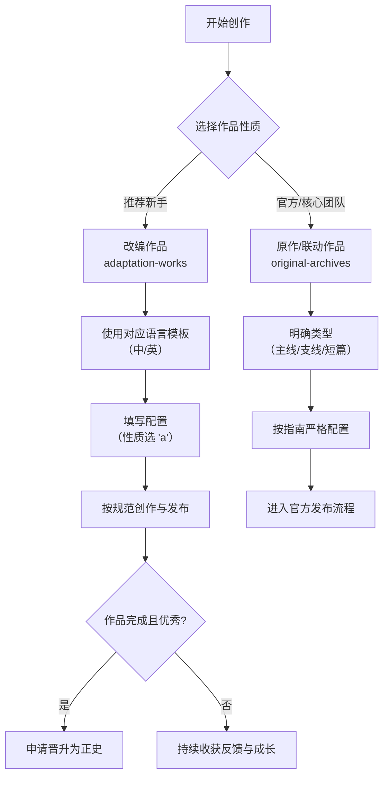

# 通用故事模板使用指南 4.3（新命名体系完全适配版）

## 简介

本指南详细说明如何使用适配新命名体系的通用故事模板来创作故事。该模板完全遵循 Beastkin Shield Universe
的标准化命名体系（版本2.1.1），并为**社区创作者**优化了引导流程。我们强烈建议新作者从**改编作品**
开始，这是融入社区、理解世界观最顺畅的路径。请根据您的创作需求，遵循本指南的步骤与规范进行操作。

---

## 核心概念与推荐路径

在开始前，了解项目结构和推荐路径至关重要：

1. **从改编开始（推荐路径）**：`adaptation-works` 是社区创作的乐园。我们**建议所有新作者从此处开始**
   ，基于现有世界观进行创作，风险低、上手快，并能获得社区的直接反馈。
2. **理解原作**：`original-archives` 存放由 **世界观第一作者** 或核心团队维护的官方作品。它是所有创作的基础和灵感来源。
3. **明确的晋升机制**：优秀的、已完成的改编作品，在获得社区认可和原作者同意后，可以**晋升**至
   `original-archives`，甚至发展为独立的世界观模块。
4. **灵活的结构**：主线作品的文件直接放在 `main/` 目录下，但支持使用子目录（如 `volume-1/`
   ）来管理多卷本长篇，这属于作品内部组织方式。

---

## 快速开始：从改编作品出发（推荐）

对于大多数创作者，尤其是新加入社区的作者，我们建议遵循以下路径：




**第一步：选择模板**
根据创作语言，从 `/templates/` 目录中复制对应模板：

- 中文创作：`universal-story-template-chinese.md`
- 英文创作：`universal-story-template-english.md`

**第二步：确定作品基础信息**

- **创作性质**：选择 **`a` (改编)**。这是社区创作的标准起点。
- **作品形式**：根据故事结构选择 `c` (分章故事) 或 `s` (短篇故事)。
- **选择世界观**：选择你想基于哪个世界观创作 (`bs`, `bsr`, `uba`)。

**第三步：填写模板配置**
在模板的“配置区”准确填写信息，**请特别注意**：

- `作品性质`：填入 **`a`**
- `作品标识名`：使用英文kebab-case (如 `my-adaptation-story`)
- `章节标题`（分章故事）：**必须填写**英文标题简写

**第四步：选择导航栏**
根据你创作的是短篇还是分章故事（及章节位置），从模板提供的8种配置中选择对应的“改编”类导航栏。

**第五步：创作与发布**

1. 在 `worlds/{世界观}/adaptation-works/{对应形式}/` 目录下，**创建一个以你的“完整作品编码”命名的新文件夹
   **。
2. 将配置好的模板文件放入此文件夹，并重命名为正确的文件名。
3. 开始你的故事创作！

**后续路径**：当你的改编作品完成并获得良好反响后，可参照指南末的 **“作品晋升机制”** 申请将其纳入正史。

---

## 新命名体系详解（基于2.1.1版本）

### 作品编码格式

```
[世界观]-[性质]-[形式]-[序号]-[作品名]
```

**对于改编作品，性质字段固定为 `a`。**

示例：

- **改编分章支线**：`bs-a-c-001-a-new-gamer` （这是社区创作的典型编码）
- 原作短篇：`bs-o-s-001-farm-inn`
- 原作主线分章：`bs-o-c` （仅核心团队使用）

### 文件命名规范

#### **1. 改编作品文件名格式（社区创作主要使用）**

**分章故事 (chaptered)**

- **格式**：`{完整作品编码}-ch-{章节编号}-{章节标题简写}.md`
- **示例**：`bs-a-c-001-a-new-gamer-ch-001-infiltration.md`
- **位置**：`worlds/bs/adaptation-works/chaptered-stories/bs-a-c-001-a-new-gamer/`

**短篇故事 (short)**

- **格式**：`{完整作品编码}.md`
- **示例**：`bs-a-s-001-first-blood.md`
- **位置**：`worlds/bs/adaptation-works/short-stories/bs-a-s-001-first-blood/`

#### **2. 原作作品文件名格式（供参考）**

**主线故事 (main)**

- **格式**：`{世界观编码}-o-c-ch-{章节编号}-{章节标题简写}.md`
- **示例**：`bs-o-c-ch-001-a-bloody-beginning.md`

**支线故事 (side)**

- **格式**：`{世界观编码}-o-c-{支线编号}-{支线名}-ch-{章节编号}-{章节标题简写}.md`
- **示例**：`bs-o-c-001-yan-liang-ch-001-infiltration.md`

**短篇故事**

- **格式**：`{世界观编码}-o-s-{作品编号}-{作品名}.md`
- **示例**：`bs-o-s-001-farm-inn.md`

### 字段说明

| 字段      | 可选值                                                                      | 含义与建议             |
|:--------|:-------------------------------------------------------------------------|:------------------|
| **世界观** | `bs`, `bsr`, `uba`                                                       | 作品所基于的世界观。        |
| **性质**  | `a` (adaptation) - **改编**<br>`o` (original) - 原作<br>`c` (crossover) - 联动 | **社区创作者请使用 `a`**。 |
| **形式**  | `c` (chaptered-story) - 分章故事<br>`s` (short-story) - 短篇故事                 | 根据故事长度和结构选择。      |
| **序号**  | 三位数字，如 `001`                                                             | 在同一世界观和形式下的顺序编号。  |
| **作品名** | 英文kebab-case，如 `my-adaptation`                                           | 作品的英文标识，请使用连字符。   |

---

## 目录结构规范

### 改编作品 (`a`) - **你的作品将在这里**

```
worlds/{世界观}/adaptation-works/{形式}/{完整作品编码}/
```

- **形式**：`chaptered-stories`（分章）或 `short-stories`（短篇）
- **完整作品编码**：如 `bs-a-c-001-a-new-gamer`

**这是你的工作目录！** 示例：

- 分章改编：`worlds/bs/adaptation-works/chaptered-stories/bs-a-c-001-a-new-gamer/`
- 短篇改编：`worlds/bs/adaptation-works/short-stories/bs-a-s-001-first-blood/`

### 原作作品 (`o`) - **你未来可能晋升的目标**

```
worlds/{世界观}/original-archives/{语言}/{形式}/{子类型}/
```

- **语言**：`chinese` 或 `english`
- **形式**：`chaptered-stories` 或 `short-stories`
- **子类型**（仅分章）：`main`（主线）或 `side`（支线）

---

## 配置详情

### 核心配置项（改编作品示例）

1. **世界观编码**：`bs`、`bsr`、`uba` （选一个）
2. **作品性质**：**`a`** （改编）
3. **作品形式**：`c` 或 `s`
4. **作品序号**：三位数字，如 `001`（请检查目录避免重复）
5. **作品标识名**：英文kebab-case，如 `my-adaptation`
6. **作品标题**：中英文完整标题
7. **章节标题**（分章故事必填）：中英文章节标题简写

### 路径配置

- **改编作品**：无需选择语言，直接在 `adaptation-works` 下创建以完整编码命名的目录即可。

---

## 导航栏配置选择

根据作品形式和章节位置，从模板中提供的8种配置里选择其一。**对于改编作品，请选择名称中带“改编”的配置**：

1. **短篇原作导航** (原作使用)
2. **短篇改编导航** (你的短篇改编使用)
3. **分章原作-第一章** (原作使用)
4. **分章原作-中间章节** (原作使用)
5. **分章原作-最后一章** (原作使用)
6. **分章改编-第一章** (你的分章改编使用)
7. **分章改编-中间章节** (你的分章改编使用)
8. **分章改编-最后一章** (你的分章改编使用)

---

## 正文格式规范

1. **段落间距**：行与行之间、段落与段落之间均保持一个空行。
2. **设定加粗**：角色、地点、组织、专有名词等设定需使用 `**加粗**`。对话内容本身不加粗。
3. **世界观特性**：所有角色均为雌雄同体的雄兽人，在评述中可自然提及。

---

## 故事评述与感慨写作指南

此部分用于以感性、口语化的语言评述角色和事件，是作品的特色之一。

### 写作结构

1. **他们最后的故事**：评述本章中所有死去的角色。用【】标注其身份与制服颜色。
2. **还活着的人们**：评述所有幸存角色。
3. **故事感慨**：以第一人称分享整体感受。

### 制服颜色区分规则（改编作品请遵循原著设定）

1. 文中明确提到了制服颜色的，按描述写。
2. 文中未明确但提到了部门的：武斗组-黑制服、枪械组-白制服、管理岗-蓝制服、未提部门-绿制服。
3. 杂兵/守卫通常指绿制服。

---

## 作品晋升机制

这是你从 `adaptation-works` 走向 `original-archives` 的桥梁。

**晋升条件**：

- **作品已完成**。
- **质量优秀**，获得社区广泛认可。
- **设定**与原著世界观**无冲突**。
- **授权清晰**，所有贡献者同意。

**晋升流程**：

1. **申请**：向项目核心团队提交晋升申请。
2. **审核**：团队审核作品质量与设定一致性。
3. **迁移与重命名**：将作品目录从 `adaptation-works` 迁移至 `original-archives` 的相应位置，并按原作标准重命名文件。
4. **更新与公告**：更新所有链接，并向社区公告。

---

## 故障排除

- **导航链接失效**：检查导航栏配置是否选错（如改编作品用了原作导航）。
- **图片不显示**：确认图片路径是否正确，图片是否已放入作品目录下的 `images/` 文件夹。
- **文件名错误**：确保遵循正确的命名规则，特别是**章节标题简写必须填写**。

---

## 更新记录

- **2025-12-13 v4.3**：重构指南逻辑，明确推荐路径
    - 彻底重构“快速开始”部分，将**创作改编作品**作为面向社区新手的**首要推荐路径**，并配以决策流程图。
    - 在“核心概念”中明确“从改编开始”的推荐建议。
    - 在文件命名、目录结构等章节，将“改编作品”相关内容前置并突出显示。
    - 增加“作品晋升机制”章节，为改编作品指明后续发展路径。
    - 优化整体表述，使指南更贴合社区创作者的实际使用场景。

- **2025-12-13 v4.2**：同步核心概念，优化指南表述
    - 新增“核心概念回顾”章节。
    - 明确主线故事可在 `main/` 下建立子目录进行内部管理。

- **2025-12-13 v4.1**：适配新命名体系2.1.0版本
    - 更新命名规则，章节标题成为必填项。

- **2025-12-13 v4.0**：新命名体系初始适配版

---

*最后更新：2025-12-13*
*文档版本：4.3*
*适配命名体系：2.1.1*